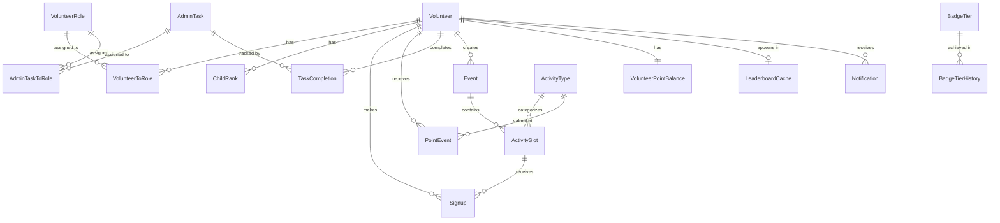

# Data Model: Volunteer Management System
## Phase 1 - Complete Prisma Schema

*Generated: 2026-03-12*  
*Feature: 001-volunteer-management*

This document defines the complete data model for the volunteer management system using Prisma ORM with SQLite.

---

## Prisma Schema

```prisma
// This is your Prisma schema file
// Learn more: https://pris.ly/d/prisma-schema

generator client {
  provider = "prisma-client-js"
}

datasource db {
  provider = "sqlite"
  url      = env("DATABASE_URL")
}

// ============================================================================
// Core Entities
// ============================================================================

model Volunteer {
  id                String    @id @default(cuid())
  email             String    @unique
  name              String
  phone             String?
  passwordHash      String
  authTier          AuthTier  @default(PARENT)
  leaderboardOptIn  Boolean   @default(true)
  
  // Relationships
  volunteerRoles    VolunteerToRole[]
  childrenRanks     ChildRank[]
  signups           Signup[]
  pointEvents       PointEvent[]        @relation("PointEventVolunteer")
  pointEventsCreated PointEvent[]       @relation("PointEventCreator")
  taskCompletions   TaskCompletion[]
  eventsCreated     Event[]
  adminTasksCreated AdminTask[]
  notifications     Notification[]
  pointBalance      VolunteerPointBalance?
  leaderboardEntry  LeaderboardCache?
  leaderboardHistory LeaderboardSnapshot[]
  tierHistory       BadgeTierHistory[]
  
  // Timestamps
  createdAt         DateTime  @default(now())
  updatedAt         DateTime  @updatedAt
  deletedAt         DateTime? // Soft delete
  
  // Indexes
  @@index([email])
  @@index([deletedAt])
  @@index([authTier])
}

enum AuthTier {
  PARENT    // Tier 1: Parent/guardian volunteer
  LEADER    // Tier 2: Den leader or committee role
  ADMIN     // Tier 3: Site admin
}

model ChildRank {
  id              String      @id @default(cuid())
  volunteerId     String
  volunteer       Volunteer   @relation(fields: [volunteerId], references: [id], onDelete: Cascade)
  rankLevel       RankLevel
  
  createdAt       DateTime    @default(now())
  
  @@unique([volunteerId, rankLevel]) // Prevent duplicate rank per volunteer
  @@index([volunteerId])
}

enum RankLevel {
  LION
  TIGER
  WOLF
  BEAR
  WEBELOS
  AOL              // Arrow of Light
  PACK_WIDE        // Not a child rank, but used for events/tasks
}

// ============================================================================
// Volunteer Roles
// ============================================================================

model VolunteerRole {
  id              String      @id @default(cuid())
  name            String      @unique
  description     String?
  roleType        RoleType
  specialty       String?     // For committee roles (e.g., "treasurer", "secretary")
  rankLevel       RankLevel?  // For den leader roles (e.g., WOLF, BEAR)
  grantsTier      AuthTier    @default(PARENT) // Authorization tier granted by this role
  
  volunteers      VolunteerToRole[]
  adminTasks      AdminTaskToRole[]
  
  createdAt       DateTime    @default(now())
  updatedAt       DateTime    @updatedAt
  deletedAt       DateTime?   // Soft delete preserves historical data
  
  @@index([deletedAt])
  @@index([roleType])
}

enum RoleType {
  PARENT_GUARDIAN
  COMMITTEE
  DEN_LEADER
  ASSISTANT_DEN_LEADER
  ASSISTANT_CUB_MASTER
  LION_GUIDE
  SCOUTER_RESERVE
}

model VolunteerToRole {
  id              String        @id @default(cuid())
  volunteerId     String
  volunteer       Volunteer     @relation(fields: [volunteerId], references: [id], onDelete: Cascade)
  roleId          String
  role            VolunteerRole @relation(fields: [roleId], references: [id], onDelete: Restrict)
  
  assignedAt      DateTime      @default(now())
  removedAt       DateTime?     // Track when role was removed (soft delete)
  
  @@unique([volunteerId, roleId]) // Prevent duplicate role assignments
  @@index([volunteerId])
  @@index([roleId])
}

// ============================================================================
// Activity Types
// ============================================================================

model ActivityType {
  id              String        @id @default(cuid())
  name            String        @unique
  pointValue      Int
  category        ActivityCategory
  description     String?
  
  activitySlots   ActivitySlot[]
  pointEvents     PointEvent[]
  
  createdAt       DateTime      @default(now())
  updatedAt       DateTime      @updatedAt
  deletedAt       DateTime?     // Soft delete
  
  @@index([deletedAt])
  @@index([category])
}

enum ActivityCategory {
  LOW       // 2-3 points
  MEDIUM    // 5-8 points
  HIGH      // 10-15 points
  SPECIAL   // 20-25 points
}

// ============================================================================
// Events & Signups
// ============================================================================

model Event {
  id              String        @id @default(cuid())
  title           String
  description     String?
  eventDate       DateTime
  eventTime       String?
  location        String?
  rankLevel       RankLevel?    // null = pack-wide
  isRecurring     Boolean       @default(false)
  isComplete      Boolean       @default(false)
  recurringEndDate DateTime?    // Auto-set to year-end from pack config
  
  activitySlots   ActivitySlot[]
  createdById     String
  createdBy       Volunteer     @relation(fields: [createdById], references: [id])
  
  createdAt       DateTime      @default(now())
  updatedAt       DateTime      @updatedAt
  deletedAt       DateTime?
  
  // Strategic indexes for common queries
  @@index([eventDate, deletedAt])        // "Show upcoming active events"
  @@index([rankLevel, eventDate])        // "Events for my rank"
  @@index([isComplete, eventDate])       // "Mark complete workflow"
  @@index([createdById])
}

model ActivitySlot {
  id              String        @id @default(cuid())
  eventId         String
  event           Event         @relation(fields: [eventId], references: [id], onDelete: Cascade)
  activityTypeId  String
  activityType    ActivityType  @relation(fields: [activityTypeId], references: [id], onDelete: Restrict)
  capacity        Int?          // null = unlimited
  
  signups         Signup[]
  
  createdAt       DateTime      @default(now())
  
  @@index([eventId])
  @@index([activityTypeId])
}

model Signup {
  id              String        @id @default(cuid())
  volunteerId     String
  volunteer       Volunteer     @relation(fields: [volunteerId], references: [id], onDelete: Cascade)
  activitySlotId  String
  activitySlot    ActivitySlot  @relation(fields: [activitySlotId], references: [id], onDelete: Cascade)
  
  withdrawn       Boolean       @default(false)
  withdrawnAt     DateTime?
  
  createdAt       DateTime      @default(now())
  deletedAt       DateTime?
  
  @@unique([volunteerId, activitySlotId]) // Prevent double signup
  @@index([volunteerId, withdrawn])       // "My active signups"
  @@index([activitySlotId, withdrawn])    // Check capacity
}

// ============================================================================
// Points & Gamification
// ============================================================================

model PointEvent {
  id              String        @id @default(cuid())
  volunteerId     String
  volunteer       Volunteer     @relation("PointEventVolunteer", fields: [volunteerId], references: [id])
  points          Int           // positive for awards, negative for revocations
  eventType       PointEventType
  referenceId     String?       // links to event/task that triggered points
  reason          String?       // required for revocations
  createdById     String
  createdBy       Volunteer     @relation("PointEventCreator", fields: [createdById], references: [id])
  activityTypeId  String?
  activityType    ActivityType? @relation(fields: [activityTypeId], references: [id], onDelete: SetNull)
  metadata        Json?         // flexible storage for activity-specific data
  
  createdAt       DateTime      @default(now())
  
  @@index([volleyId, createdAt])
  @@index([eventType])
  @@index([createdById])
}

enum PointEventType {
  EVENT_PARTICIPATION
  TASK_COMPLETION
  ROLE_ASSIGNMENT      // 100 points for committee/den leader
  ADMIN_REVOCATION
}

model VolunteerPointBalance {
  volunteerId     String        @id
  volunteer       Volunteer     @relation(fields: [volunteerId], references: [id], onDelete: Cascade)
  totalPoints     Int           @default(0)
  currentYearPoints Int         @default(0)
  
  lastUpdatedAt   DateTime      @updatedAt
  
  @@index([totalPoints])
  @@index([currentYearPoints])
}

model LeaderboardCache {
  volunteerId     String        @id
  volunteer       Volunteer     @relation(fields: [volunteerId], references: [id], onDelete: Cascade)
  rank            Int?
  totalPoints     Int
  badgeTier       String?
  
  lastUpdatedAt   DateTime      @updatedAt
  
  @@index([rank])
  @@index([totalPoints])
}

model LeaderboardSnapshot {
  id              String        @id @default(cuid())
  snapshotDate    DateTime
  volunteerId     String
  volunteer       Volunteer     @relation(fields: [volunteerId], references: [id])
  rank            Int?
  totalPoints     Int
  badgeTier       String?
  
  @@index([snapshotDate, volunteerId])
}

// ============================================================================
// Badge Tiers
// ============================================================================

model BadgeTier {
  id              String        @id @default(cuid())
  tierName        String        @unique
  minPoints       Int
  maxPoints       Int?          // NULL for highest tier
  displayOrder    Int
  badgeColor      String        // hex color for UI
  iconPath        String?
  
  tierHistory     BadgeTierHistory[]
  
  @@index([displayOrder])
}

model BadgeTierHistory {
  id              String        @id @default(cuid())
  volunteerId     String
  volunteer       Volunteer     @relation(fields: [volunteerId], references: [id])
  oldTier         String?       // NULL for first tier
  newTier         String
  pointsAtChange  Int
  achievedAt      DateTime      @default(now())
  
  @@index([volunteerId, achievedAt])
}

// ============================================================================
// Administrative Tasks
// ============================================================================

model AdminTask {
  id              String        @id @default(cuid())
  name            String
  description     String?
  dueDate         DateTime
  completionSteps String?       // JSON array of steps with URLs
  isPackWide      Boolean       @default(false)
  isRecurring     Boolean       @default(false)
  recurringEndDate DateTime?    // Auto-set to year-end from pack config
  
  assignedRoles   AdminTaskToRole[]
  completions     TaskCompletion[]
  createdById     String
  createdBy       Volunteer     @relation(fields: [createdById], references: [id])
  
  createdAt       DateTime      @default(now())
  updatedAt       DateTime      @updatedAt
  deletedAt       DateTime?
  
  @@index([dueDate, deletedAt])
  @@index([isPackWide])
  @@index([createdById])
}

model AdminTaskToRole {
  id              String        @id @default(cuid())
  taskId          String
  task            AdminTask     @relation(fields: [taskId], references: [id], onDelete: Cascade)
  roleId          String
  role            VolunteerRole @relation(fields: [roleId], references: [id], onDelete: Restrict)
  
  assignedAt      DateTime      @default(now())
  
  @@unique([taskId, roleId])
  @@index([taskId])
  @@index([roleId])
}

model TaskCompletion {
  id              String        @id @default(cuid())
  taskId          String
  task            AdminTask     @relation(fields: [taskId], references: [id], onDelete: Cascade)
  volunteerId     String
  volunteer       Volunteer     @relation(fields: [volunteerId], references: [id])
  
  completedAt     DateTime      @default(now())
  isComplete      Boolean       @default(true)
  
  @@unique([taskId, volunteerId]) // One completion per volunteer per task
  @@index([taskId])
  @@index([volunteerId])
  @@index([completedAt])
}

// ============================================================================
// Pack Configuration
// ============================================================================

model PackConfig {
  id              String        @id @default(cuid())
  packName        String
  packNumber      String
  yearStartDate   DateTime
  yearEndDate     DateTime
  activeRanks     Json          // JSON array of active RankLevel enums
  
  createdAt       DateTime      @default(now())
  updatedAt       DateTime      @updatedAt
}

// ============================================================================
// Notifications
// ============================================================================

model Notification {
  id              String              @id @default(cuid())
  volunteerId     String
  volunteer       Volunteer           @relation(fields: [volunteerId], references: [id], onDelete: Cascade)
  type            NotificationType
  message         String
  isRead          Boolean             @default(false)
  
  createdAt       DateTime            @default(now())
  
  @@index([volunteerId, isRead])
  @@index([createdAt])
}

enum NotificationType {
  BADGE_ACHIEVEMENT
  TASK_COMPLETION
  EVENT_REMINDER
  POINT_AWARD
  POINT_REVOCATION
}

// ============================================================================
// Password Reset Tokens
// ============================================================================

model PasswordReset {
  id              String        @id @default(cuid())
  email           String
  token           String        @unique // Hashed SHA-256 token
  expiresAt       DateTime
  used            Boolean       @default(false)
  
  createdAt       DateTime      @default(now())
  
  @@index([email, used])
  @@index([expiresAt])
}

// ============================================================================
// Audit Log
// ============================================================================

model AuditLog {
  id              String        @id @default(cuid())
  userId          String?       // Can be null for system actions
  action          String        // e.g., "ROLE_ASSIGNED", "POINTS_REVOKED", "EVENT_CREATED"
  entityType      String        // e.g., "VolunteerRole", "PointEvent", "Event"
  entityId        String
  changes         Json?         // Before/after values
  ipAddress       String?
  userAgent       String?
  
  createdAt       DateTime      @default(now())
  
  @@index([userId, createdAt])
  @@index([entityType, entityId])
  @@index([createdAt])
}
```

---

## Entity Relationships



---

## Validation Rules

### Volunteer
- **Email**: Must be unique, valid email format
- **Password**: Minimum 8 characters, must include uppercase, lowercase, number, special character (enforced at application layer)
- **Name**: Required, 1-100 characters
- **Phone**: Optional, valid phone format
- **AuthTier**: Automatically set based on assigned roles (LEADER if committee/den leader role, otherwise PARENT)

### VolunteerRole
- **Name**: Required, unique, 3-100 characters
- **RoleType**: Required
- **Specialty**: Required only for COMMITTEE role type
- **RankLevel**: Required only for DEN_LEADER role type
- **Cannot delete**: If role is assigned to volunteers for future events (FR-054, FR-055)

### ActivityType
- **Name**: Required, unique
- **PointValue**: Must be positive integer
- **Category**: Must match point value ranges (LOW: 2-3, MEDIUM: 5-8, HIGH: 10-15, SPECIAL: 20-25)

### Event
- **Title**: Required, 3-200 characters
- **EventDate**: Must be today or future date
- **RankLevel**: null for pack-wide events
- **RecurringEndDate**: Auto-set to yearEndDate from PackConfig if isRecurring = true

### ActivitySlot
- **Capacity**: If set, must be positive integer
- **Cannot delete parent Event**: If signups exist (onDelete: Cascade handles this)

### Signup
- **Unique constraint**: One signup per volunteer per activity slot
- **Withdrawn**: Cannot be undone once withdrawn (business rule)
- **Capacity check**: Application layer validates capacity before allowing signup

### PointEvent
- **Points**: Can be negative for revocations
- **Reason**: Required when eventType = ADMIN_REVOCATION
- **Immutable**: Cannot update or delete point events (append-only audit trail)

### AdminTask
- **Name**: Required, 3-200 characters
- **DueDate**: Must be future date
- **CompletionSteps**: JSON array format: `[{"step": "description", "url": "https://..."}]`
- **RecurringEndDate**: Auto-set to yearEndDate from PackConfig if isRecurring = true

### PackConfig
- **YearStartDate < YearEndDate**: Validation at application layer
- **ActiveRanks**: JSON array of valid RankLevel enums

### Badge Tiers (Seeded Data)
```typescript
const defaultBadgeTiers = [
  { tierName: 'Lion', minPoints: 0, maxPoints: 19, displayOrder: 1, badgeColor: '#FFD700' },
  { tierName: 'Tiger', minPoints: 20, maxPoints: 39, displayOrder: 2, badgeColor: '#FF8C00' },
  { tierName: 'Wolf', minPoints: 40, maxPoints: 59, displayOrder: 3, badgeColor: '#DC143C' },
  { tierName: 'Bear', minPoints: 60, maxPoints: 79, displayOrder: 4, badgeColor: '#8B4513' },
  { tierName: 'Webelos', minPoints: 80, maxPoints: 99, displayOrder: 5, badgeColor: '#4169E1' },
  { tierName: 'Arrow of Light', minPoints: 100, maxPoints: null, displayOrder: 6, badgeColor: '#DAA520' }
]
```

---

## State Transitions

### Volunteer AuthTier
```
New Registration → PARENT (default)
                 ↓
Assigned Committee/Den Leader Role → auto-upgrade to LEADER
                 ↓
All LEADER roles removed → auto-downgrade to PARENT
                 ↓
Manual admin promotion → ADMIN
```

### Event Lifecycle
```
Created (isComplete: false) 
   ↓
Signups Collected
   ↓
Event Occurs
   ↓
Marked Complete (isComplete: true) → Auto-award points to non-withdrawn signups
   ↓
Historical Record (deletedAt: null, always queryable)
```

### Signup Lifecycle
```
Created (withdrawn: false)
   ↓
[Optional] Withdraw (withdrawn: true, withdrawnAt: DateTime) → Cannot undo
```

### Administrative Task Lifecycle
```
Created (dueDate: future)
   ↓
Assigned to Roles
   ↓
Volunteers Complete (TaskCompletion created)
   ↓
[If overdue] DueDate < now → Mark as "overdue" in UI
```

### Badge Tier Progression
```
New Volunteer (0 points → Lion)
   ↓
Earn Points
   ↓
Cross Threshold (e.g., 20 points) → Tiger
   ↓
BadgeTierHistory record created
   ↓
Notification sent
```

---

## Indexes Strategy

### High-Traffic Queries
1. **Upcoming Events for Volunteer's Ranks**
   - Index: `Event(rankLevel, eventDate, deletedAt)`
   - Query: `WHERE rankLevel IN (volunteer.childrenRanks) AND eventDate > now() AND deletedAt IS NULL`

2. **Leaderboard Display**
   - Index: `LeaderboardCache(rank)` and `LeaderboardCache(totalPoints)`
   - Query: `WHERE volunteer.leaderboardOptIn = true ORDER BY rank`

3. **Volunteer's Active Signups**
   - Index: `Signup(volunteerId, withdrawn)`
   - Query: `WHERE volunteerId = ? AND withdrawn = false`

4. **Available Activity Slots (Capacity Check)**
   - Index: `Signup(activitySlotId, withdrawn)`
   - Query: `COUNT(*) WHERE activitySlotId = ? AND withdrawn = false`

5. **Overdue Administrative Tasks**
   - Index: `AdminTask(dueDate, deletedAt)`
   - Query: `WHERE dueDate < now() AND deletedAt IS NULL`

### Audit & Reporting Queries
1. **Point Event History for Volunteer**
   - Index: `PointEvent(volunteerId, createdAt)`
   - Query: `WHERE volunteerId = ? ORDER BY createdAt DESC`

2. **All Actions by Admin User**
   - Index: `AuditLog(userId, createdAt)`
   - Query: `WHERE userId = ? ORDER BY createdAt DESC`

---

## Migration Considerations

### Initial Setup
1. Run `prisma migrate dev --name init` to create initial schema
2. Seed default data:
   - Badge tiers (6 tiers: Lion through Arrow of Light)
   - Default activity types (low/medium/high/special categories)
   - Initial pack configuration
   - Default volunteer roles (parent/guardian, committee, den leader, etc.)

### Soft Delete Pattern
- Never use `prisma.model.delete()` in application code
- Always use `prisma.model.update({ data: { deletedAt: new Date() } })`
- Implement Prisma middleware to enforce soft deletes globally:

```typescript
prisma.$use(async (params, next) => {
  if (params.action === 'delete' && params.model !== 'PasswordReset') {
    params.action = 'update'
    params.args['data'] = { deletedAt: new Date() }
  }
  if (params.action === 'deleteMany' && params.model !== 'PasswordReset') {
    params.action = 'updateMany'
    if (params.args.data !== undefined) {
      params.args.data['deletedAt'] = new Date()
    } else {
      params.args['data'] = { deletedAt: new Date() }
    }
  }
  return next(params)
})
```

### Future Schema Changes
- Always use migrations (`prisma migrate dev`)
- Test migrations against production-like data volumes
- Consider backward compatibility for API consumers

---

## Performance Optimization

### Connection Pooling (SQLite)
- Use `connection_limit=1` for SQLite (single-writer limitation)
- Consider Read replicas if read-heavy workload grows

### Query Optimization
- Use `prisma.model.findUnique()` when querying by unique fields (faster than `findFirst`)
- Use `select` to limit returned fields in large result sets
- Use `include` sparingly; prefer joins only when needed

### Caching Strategy
- Cache leaderboard results (refresh daily via background job)
- Cache badge tier thresholds (static configuration)
- Cache pack configuration (changes infrequently)

---

## Next Steps

This data model will be implemented in:
1. **Backend Prisma Setup**: `backend/prisma/schema.prisma` (this file)
2. **API Contracts**: Define RESTful endpoints in `/contracts/` directory
3. **Quickstart Guide**: Setup instructions in `quickstart.md`
