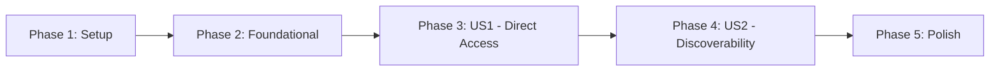

# Tasks: Dashboard Profile Edit Navigation

**Feature**: 002-edit-profile-button  
**Branch**: `002-edit-profile-button`  
**Generated**: 2026-05-04

**Input**: Design documents from `/specs/002-edit-profile-button/`  
**Prerequisites**: ✅ plan.md, spec.md, research.md, data-model.md, quickstart.md, contracts/

---

## Format: `- [ ] [ID] [P?] [Story] Description`

- **[P]**: Can run in parallel (different files, no dependencies)
- **[Story]**: Which user story this task belongs to (e.g., US1, US2)
- All paths include exact file locations

---

## Phase 1: Setup & Verification

**Purpose**: Verify development environment and dependencies are ready

- [X] T001 Verify frontend development environment (`cd frontend && npm install`)
- [X] T002 [P] Start frontend dev server and confirm dashboard page loads (`npm run dev`)
- [X] T003 [P] Confirm profile edit page exists at `/profile/edit` route

**Checkpoint**: Development environment ready - no new dependencies or setup required

---

## Phase 2: Foundational (No Blocking Prerequisites)

**Purpose**: Core infrastructure that MUST be complete before user story implementation

**Status**: ✅ NO FOUNDATIONAL WORK NEEDED

- Dashboard page already exists (`frontend/src/app/dashboard/page.tsx`)
- Profile edit page already exists (`frontend/src/app/profile/edit/page.tsx`)
- Authentication system already implemented (`useRequireAuth` hook)
- Button component already available (`@/components/ui/button`)
- Router navigation pattern established (`useRouter` from `next/navigation`)

**Checkpoint**: All infrastructure exists - proceed directly to user story implementation

---

## Phase 3: User Story 1 - Direct Profile Edit Access (Priority: P1) 🎯 MVP

**Goal**: Add "Edit Profile" button to dashboard that navigates directly to profile edit page

**Independent Test**: Login, view dashboard, click "Edit Profile" button, verify navigation to `/profile/edit`

**BDD Requirement**: Write tests FIRST, ensure they FAIL, then implement

### Tests for User Story 1 (RED Phase)

- [X] T004 [P] [US1] Add test for Edit Profile button presence in `frontend/src/app/dashboard/page.test.tsx`
- [X] T005 [P] [US1] Add test for button click navigation to `/profile/edit` in `frontend/src/app/dashboard/page.test.tsx`
- [X] T006 [P] [US1] Add test for button hidden when not authenticated in `frontend/src/app/dashboard/page.test.tsx`
- [X] T007 [US1] Run tests and verify all 3 new tests FAIL (`cd frontend && npm test dashboard/page.test.tsx`)

### Implementation for User Story 1 (GREEN Phase)

- [X] T008 [US1] Import `useRouter` from `next/navigation` in `frontend/src/app/dashboard/page.tsx`
- [X] T009 [US1] Initialize router instance in DashboardPage component in `frontend/src/app/dashboard/page.tsx`
- [X] T010 [US1] Add Edit Profile button to "Your Profile" Card with `onClick={() => router.push('/profile/edit')}` in `frontend/src/app/dashboard/page.tsx`
- [X] T011 [US1] Run tests and verify all new tests PASS (`cd frontend && npm test dashboard/page.test.tsx`)

### Manual Verification for User Story 1

- [X] T012 [US1] Manual test: Start dev server, login, verify button appears on dashboard
- [X] T013 [US1] Manual test: Click button and verify navigation to `/profile/edit`
- [X] T014 [US1] Manual test: Verify button responsive design on mobile viewport (DevTools)

**Checkpoint**: User Story 1 complete - button exists, tests pass, navigation works

---

## Phase 4: User Story 2 - Clear Profile Edit Discoverability (Priority: P2)

**Goal**: Ensure Edit Profile button is easily discoverable with clear labeling

**Independent Test**: Show dashboard to test user, ask them to locate profile editing - should find within 10 seconds

**Note**: This story is achieved through the implementation of US1 (button placement, labeling, and styling). Tasks focus on verification rather than new implementation.

### Verification for User Story 2

- [X] T015 [US2] Verify button uses clear action-oriented label ("Edit Profile") in `frontend/src/app/dashboard/page.tsx`
- [X] T016 [US2] Verify button is in "Your Profile" card (logical proximity to profile data) in `frontend/src/app/dashboard/page.tsx`
- [X] T017 [US2] Verify button styling uses appropriate variant (e.g., `variant="outline"`) in `frontend/src/app/dashboard/page.tsx`
- [X] T018 [US2] Verify button placement ensures visibility without scrolling on desktop and mobile viewports
- [X] T019 [US2] Manual test: Confirm button text is semantic and accessible to screen readers

**Checkpoint**: User Story 2 complete - button is discoverable, clearly labeled, and accessible

---

## Phase 5: Polish & Cross-Cutting Concerns

**Purpose**: Code quality, documentation, and final validation

### Refactor Phase

- [X] T020 [P] Review button styling for consistency with dashboard design patterns
- [X] T021 [P] Add inline comment if button placement needs clarification (optional - code is self-documenting)
- [X] T022 Verify no code duplication - router import not duplicated, pattern matches existing code
- [X] T023 Run linter and fix any issues (`cd frontend && npm run lint`)

### Full Test Suite Validation

- [X] T024 Run complete frontend test suite and verify no regressions (`cd frontend && npm test`)
- [X] T025 [P] Verify test coverage meets project standards (if applicable)
- [X] T026 Manual end-to-end test: Login → Dashboard → Edit Profile → Make change → Save → Verify change persisted

### Documentation & Validation

- [X] T027 [P] Review quickstart.md implementation guide for accuracy
- [X] T028 Verify all acceptance criteria from spec.md are met
- [X] T029 [P] Update any relevant user documentation (if project has user-facing docs)
- [X] T030 Final commit with descriptive message (e.g., "feat(dashboard): add Edit Profile button for direct navigation")

**Checkpoint**: Feature complete, tested, and ready for pull request

---

## Dependencies & Execution Order

### Phase Dependencies



- **Setup (Phase 1)**: No dependencies - can start immediately
- **Foundational (Phase 2)**: ✅ No work needed (all infrastructure exists)
- **User Story 1 (Phase 3)**: Can start immediately after setup verification
- **User Story 2 (Phase 4)**: Depends on US1 completion (verification only)
- **Polish (Phase 5)**: Depends on US1 and US2 completion

### User Story Dependencies

- **User Story 1 (P1)**: Independent - no dependencies on other stories
- **User Story 2 (P2)**: Achieved by US1 implementation - verification tasks only

### Within User Story 1 (Critical Path)

1. **T004-T006** [P]: Write all tests in parallel (different test cases in same file)
2. **T007**: Run tests and confirm FAILURE (blocking - must fail before implementation)
3. **T008-T010**: Implement feature (sequential in same file to avoid conflicts)
4. **T011**: Run tests and confirm SUCCESS (blocking - must pass before proceeding)
5. **T012-T014** [P]: Manual verification (can run in parallel)

### Parallel Opportunities

**Phase 1 (Setup)**:
```bash
# Can run simultaneously in different terminal sessions:
Terminal 1: T002 - Start dev server
Terminal 2: T003 - Test profile edit page access
```

**Phase 3 (Tests)**:
```bash
# Write all test cases at once (same file, different describe blocks):
- T004: Button presence test
- T005: Navigation test
- T006: Auth test
# Then run T007 to verify all fail together
```

**Phase 3 (Manual Tests)**:
```bash
# After implementation passes, verify manually:
- T012: Button appears
- T013: Navigation works
- T014: Responsive design
# Can be done in quick succession
```

**Phase 5 (Polish)**:
```bash
# Independent review tasks:
- T020: Styling review
- T021: Documentation review
- T025: Coverage check
- T027: Quickstart accuracy
- T029: User docs update
```

---

## Implementation Strategy

### MVP-First Approach (Recommended)

**Goal**: Deliver User Story 1 as functional MVP

1. ✅ **Phase 1: Setup** (5-10 minutes)
   - Verify environment ready
   
2. ⚠️ **Skip Phase 2**: No foundational work needed

3. 🎯 **Phase 3: User Story 1** (45-60 minutes)
   - **RED**: Write failing tests (T004-T007) - 20 minutes
   - **GREEN**: Implement button (T008-T011) - 15 minutes
   - **Verify**: Manual testing (T012-T014) - 10 minutes
   
4. **STOP & VALIDATE**: Test independently, demo if ready

5. **Phase 4: User Story 2** (15-20 minutes)
   - Verify discoverability (T015-T019)
   
6. **Phase 5: Polish** (20-30 minutes)
   - Refactor, test suite, documentation (T020-T030)

**Total Estimated Time**: 1.5-2 hours

### Incremental Delivery Checkpoints

- ✅ After T003: Environment verified - ready to code
- ✅ After T007: Tests written and failing (RED phase complete)
- ✅ After T011: Tests passing (GREEN phase complete) - **Feature functional**
- ✅ After T014: Manual testing complete - **US1 deliverable**
- ✅ After T019: Discoverability verified - **US2 deliverable**
- ✅ After T030: Polish complete - **Feature ready for PR**

### Red-Green-Refactor Enforcement

**RED (T004-T007)**: Tests must fail before implementation
```bash
cd frontend
npm test dashboard/page.test.tsx
# Expected: 3 new tests fail with "Edit Profile button not found" errors
```

**GREEN (T008-T011)**: Implement minimum code to pass tests
```bash
# Add router import, initialize router, add button
npm test dashboard/page.test.tsx
# Expected: All tests pass
```

**REFACTOR (T020-T023)**: Improve code quality while keeping tests green
```bash
# Review styling, remove duplication, add comments if needed
npm test dashboard/page.test.tsx
# Expected: All tests still pass after refactoring
```

---

## File Change Summary

**Files Modified**: 2  
**Files Added**: 0  
**Lines Added**: ~35 (including tests and implementation)

### Modified Files

1. **`frontend/src/app/dashboard/page.tsx`**
   - Add: `import { useRouter } from 'next/navigation';`
   - Add: `const router = useRouter();` (inside component)
   - Add: Button component in "Your Profile" Card (~5 lines)
   - **Total**: ~10 lines added

2. **`frontend/src/app/dashboard/page.test.tsx`**
   - Add: New `describe('Profile Edit Navigation')` block with 3 test cases
   - Add: Mock setup for router.push
   - **Total**: ~25 lines added

---

## Acceptance Criteria Verification

### User Story 1 - Direct Profile Edit Access (P1)

| Acceptance Criterion | Verified By | Status |
|---------------------|-------------|--------|
| AC1: Dashboard displays clearly labeled "Edit Profile" element | T004, T015 | After T015 |
| AC2: Clicking element navigates to profile edit page | T005, T013 | After T013 |
| AC3: Users can only edit their own profile | ✅ Inherited (profile edit page enforces this) | N/A |
| AC4: Unauthenticated users redirected to login | ✅ Inherited (dashboard page requires auth) | N/A |

### User Story 2 - Clear Profile Edit Discoverability (P2)

| Acceptance Criterion | Verified By | Status |
|---------------------|-------------|--------|
| AC1: Element visible without scrolling | T018 | After T018 |
| AC2: Label clearly indicates action | T015, T019 | After T019 |
| AC3: Findable within 10 seconds | T019 (manual test) | After T019 |

---

## Risk Mitigation

| Risk | Mitigation | Task |
|------|-----------|------|
| Tests not failing initially | Run tests before implementation, verify failure message | T007 |
| Button conflicts with existing layout | Manual test on mobile viewport, adjust styling | T014, T018 |
| Router mock not configured | Verify mock setup in test file, follow existing patterns | T005 |
| Linting errors after implementation | Run linter, fix issues before final commit | T023 |
| Regression in other dashboard features | Run full test suite, verify no failures | T024 |

---

## Completion Checklist

Before marking feature complete and creating pull request:

- [ ] All tests written and initially failing (RED phase verified)
- [ ] All tests now passing (GREEN phase verified)
- [ ] Code refactored and cleaned (REFACTOR phase complete)
- [ ] Manual testing complete on desktop and mobile
- [ ] Full test suite passes with no regressions
- [ ] Linter passes with no errors
- [ ] All acceptance criteria verified
- [ ] quickstart.md implementation guide validated
- [ ] Code committed with descriptive message
- [ ] Ready for pull request and code review

---

## Notes

- **Tests are REQUIRED** for this feature (BDD constitutional principle)
- Button placement in "Your Profile" card ensures logical proximity to profile data
- Existing navigation pattern (`router.push('/profile/edit')`) reused from leaderboard and volunteer detail pages
- No backend changes required - feature is frontend-only UI enhancement
- Authentication and authorization enforced by existing page-level guards
- Feature delivers value in ~2 hours of focused development time
